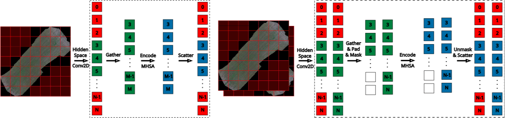
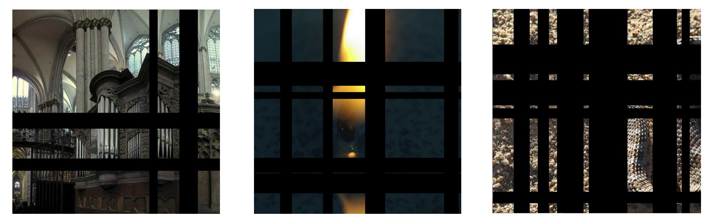

# Vision Transformer with Sparse Encoder

<p align="center">
  
</p>

## Abstract

Vision Transformers have become a decent alternative to convolutional neural networks in computer vision and pattern recognition tasks. These machine learning models gradually transform the hidden vector representation of an image using an attention mechanism, sequentially aggregating information between all its elements. This allows for the detection of patterns in the input data. However, attention is an algorithm with quadratic complexity. Its processing speed depends on the number of embeddings that interpret the input image in the hidden space. In tasks where images are sparse, processing empty data can significantly slow down the neural network. This paper proposes a Sparse Encoder that allows excluding it from the attention mechanism’s receptive field. Through its use in the Vision Transformer, significant acceleration is achieved, depending on the sparsity of the input data.

## Prerequisite

### Installation

* Set up conda environment:

    ```bash
    conda env create -n vit-se -f environment.yml
    conda activate vit-se
    ```

* Install dependencies:

    ```bash
    pip install -r requirements.txt
    ```

Be aware that preinstalled CUDA is required to run the project on GPU
(instructions [here](https://developer.nvidia.com/cuda-downloads)).

### ImageNet-1K Dataset

Experiments were conducted on the ImageNet-1K dataset. To download it, follow these steps:

* Register at [ImageNet](https://www.image-net.org/).

* Access and download [ILSVRC2012 (ImageNet-1K)](https://www.image-net.org/download.php) dataset.

* Organize the dataset in the following way:

    ```bash
    imagenet-1k
    ├── train
    │   ├── n01440764
    │   │   ├── n01440764_10026.JPEG
    │   │   ├── ...
    │   ├── ...
    ├── val
    │   ├── n01440764
    │   │   ├── ILSVRC2012_val_00000293.JPEG
    │   │   ├── ...
    │   ├── ...
    ```

    Notice that class labels (*n01440764*, etc.) are in subfolders' names instead of images filenames' postfixes. Folder tree structure like this is required for **torchvision** *ImageFolder* generic dataloader.

Taking the fact that the ImageNet-1K dataset is not sparse by default into consideration, a "sparsification" augmentation is implemented which erases random vertical/horizontal lines until certain ratio is reached. Though not true sparsity, it still helps to study effectiveness of the Sparse Encoder.

<p align="center">
  
</p>

## Usage

### Training

ViT/SE (Vision Transformer with Sparse Encoder) uses pure ViT weights for ImageNet-1K classification as checkpoints. A loader from **torchvision** downloads them automatically upon launching training or testing. The only weight that is being removed as proposed by the paper "Effective data processing in Vision Transformers" is bias in the hidden space projection convolution.

If you want to train ViT/SE (for example, on a different dataset) with chosen pretrained ViT variation weights, run `train.py`:

```bash
python3 train.py [--epochs EPOCHS] [--batch_size BATCH_SIZE] [--num_workers NUM_WORKERS] --experiment_name EXPERIMENT_NAME [--model_name MODEL_NAME] [--resize_size RESIZE_SIZE] [--crop_size CROP_SIZE] [--interpolation INTERPOLATION] [--lr LR] [--warmup_epochs WARMUP_EPOCHS] [--weight_decay WEIGHT_DECAY] [--randaug_n RANDAUG_N] [--randaug_m RANDAUG_M] [--mixup_alpha MIXUP_ALPHA] [--weights WEIGHTS] [--data_path DATA_PATH] [--output_dir OUTPUT_DIR] [--device DEVICE] [--seed SEED]

options:
  --epochs EPOCHS
  --batch_size BATCH_SIZE
  --num_workers NUM_WORKERS
  --experiment_name EXPERIMENT_NAME
                        Name of the experiment, used for saving checkpoints and logs
  --model_name MODEL_NAME
                        Name of the ViT/SE model to use
  --resize_size RESIZE_SIZE
                        256 for ViT/SE-B, 242 for ViT/SE-L, 518 for ViT/SE-H
  --crop_size CROP_SIZE
                        224 for ViT/SE-B and ViT-L, 518 for ViT/SE-H
  --interpolation INTERPOLATION
                        "bilinear" for ViT/SE-B and ViT/SE-L, "bicubic" for ViT/SE-H
  --lr LR               Base learning rate
  --warmup_epochs WARMUP_EPOCHS
                        Amount of warmup epochs
  --weight_decay WEIGHT_DECAY
                        Weight decay
  --randaug_n RANDAUG_N
                        BigVisionRandAugment number of operations
  --randaug_m RANDAUG_M
                        BigVisionRandAugment magnitude
  --mixup_alpha MIXUP_ALPHA
                        TwoHotMixUp alpha value
  --weights WEIGHTS     Path to checkpoint to use (optional)
  --data_path DATA_PATH
                        Path to dataset
  --output_dir OUTPUT_DIR Path to save checkpoints
  --device DEVICE       Training device
  --seed SEED
```

Example for launching the training of ViT/SE-H/14 with recommended default settings would look like this:

```bash
python3 train.py --experiment_name custom_vit_se_h_14 --model_name vit_se_h_14 --resize_size 518 --crop_size 518 --interpolation bicubic --data_path /path/to/imagenet-1k --output_dir .
```

During training in the end of each epoch, a checkpoint is saved with the name `last.pth`. A validation loss tracker is being used to also preserve `best.pth` model in case of overfitting. Metrics are being logged into `log.txt`.

### Evaluation

If you want to evaluate ViT/SE with chosen pretrained ViT variation weights or your custom weights that were saved after
running `train.py` accordingly, run `test.py`:

```bash
python3 test.py [--batch_size BATCH_SIZE] [--num_workers NUM_WORKERS] [--model_name MODEL_NAME] [--resize_size RESIZE_SIZE] [--crop_size CROP_SIZE] [--interpolation INTERPOLATION] [--weights WEIGHTS] [--data_path DATA_PATH] [--device DEVICE] [--erase_ratio ERASE_RATIO] [--seed SEED]

options:
  --batch_size BATCH_SIZE
  --num_workers NUM_WORKERS
  --model_name MODEL_NAME
                        Name of the ViT/SE model to use
  --resize_size RESIZE_SIZE
                        256 for ViT/SE-B, 242 for ViT/SE-L, 518 for ViT/SE-H
  --crop_size CROP_SIZE
                        224 for ViT/SE-B and ViT-L, 518 for ViT/SE-H
  --interpolation INTERPOLATION
                        "bilinear" for ViT/SE-B and ViT/SE-L, "bicubic" for ViT/SE-H
  --weights WEIGHTS     Path to weights of trained model (optional)
  --data_path DATA_PATH
                        Path to dataset
  --device DEVICE       Evaluation device
  --erase_ratio ERASE_RATIO
  --seed SEED
```

Example for launching the evaluation of ViT/SE-H/14 with recommended default settings would look like this:

```bash
python3 test.py --model_name vit_se_h_14 --resize_size 518 --crop_size 518 --interpolation bicubic --data_path /path/to/imagenet-1k
```

## Results

Due to lack of new parametrized operations, no new weights are to be distributed. Theoretically, ViT/SE will train differently from that of original model if the input data is sparse due to attention masking. Later on pretrained weights on widely recognized open sparse image benchmarks might be released.

As per the paper, evaluation experiments were conducted on a single NVIDIA GeForce RTX 3070 Ti with batch size being 32 samples. Masked ViT is the original ViT with empty patches masked using an *attention mask*.

Comparison of models with fixed sparsity ratio – 50 %:

| Model             | Latency, ms   | Acceleration, ms | Acceleration, % | Acc@1, % | Acc@5, % |
|-------------------|---------------|------------------|-----------------|----------|----------|
| Masked ViT–B/16   | 1.594         | –                | –               | 63.568   | 83.834   |
| Masked ViT–B/32   | 1.372         | –                | –               | 44.706   | 67.546   |
| Masked ViT–L/16   | 5.475         | –                | –               | 64.838   | 84.918   |
| Masked ViT–L/32   | 1.594         | –                | –               | 46.664   | 69.054   |
| Masked ViT–H/14   | 90.241        | –                | –               | 78.552   | 93.576   |
| ViT/SE–B/16       | 1.500         | 0.094            | 5.900           | 63.570   | 83.844   |
| ViT/SE–B/32       | 1.269         | 0.103            | 6.462           | 44.708   | 67.540   |
| ViT/SE–L/16       | 4.647         | 0.828            | 15.123          | 64.840   | 84.916   |
| ViT/SE–L/32       | 1.628         | -0.034           | -2.133          | 46.666   | 69.046   |
| ViT/SE–H/14       | 60.994        | 29.247           | 32.410          | 78.558   | 93.580   |

Latency and accuracy dependence on the sparsity ratio on ViT/SE-H/14:

| Sparsity, %      | Latency, ms   | Acceleration, ms | Acceleration, % | Acc@1, % | Acc@5, % |
|------------------|---------------|------------------|-----------------|----------|----------|
| 0                | 88.581        | –                | –               | 88.216   | 98.614   |
| 20               | 82.028        | 6.553            | 7.398           | 86.546   | 97.820   |
| 40               | 70.666        | 17.915           | 20.224          | 82.308   | 95.794   |
| 60               | 53.497        | 35.084           | 39.607          | 72.320   | 90.032   |
| 80               | 33.572        | 55.009           | 62.100          | 42.278   | 63.756   |

## Citation

```bibtex
@article{makarov2025vit-se,
  title = {Effective sparse data processing in Vision Transformers},
  volume = {},
  url = {},
  doi = {},
  number = {},
  journal = {Vestnik of Saint Petersburg State University. Applied Mathematics. Computer Science. Control Processes},
  author = {Makarov, Georgy V.},
  year = {2025},
  pages = {}
}
```
